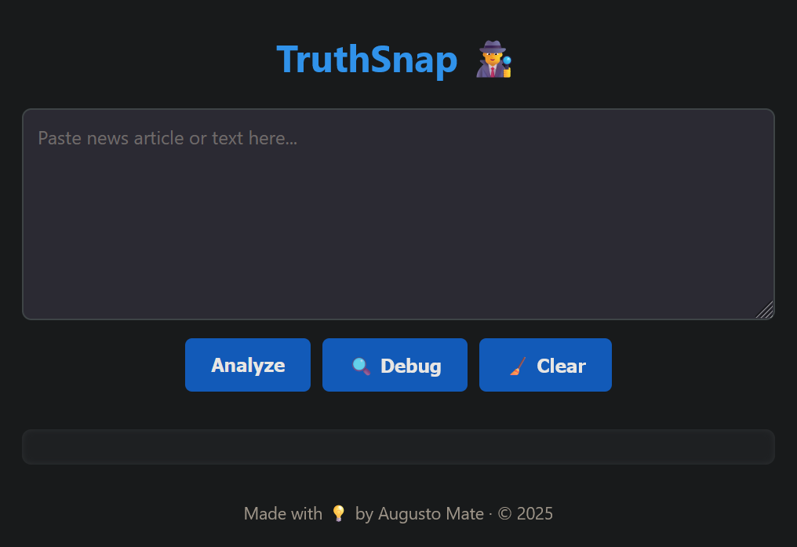
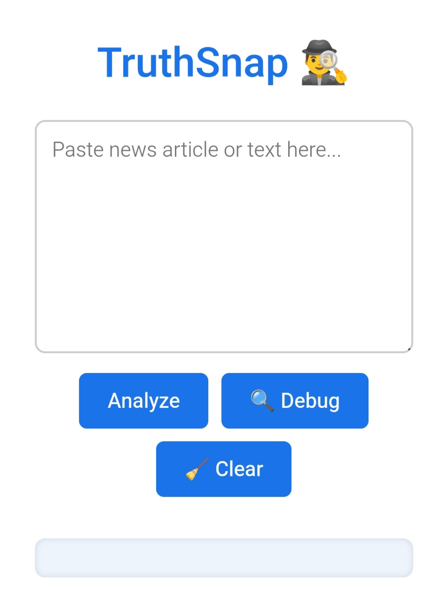

# 🔍 TruthSnap

[](https://augusto047.github.io/truthsnap/)


**TruthSnap** is a lightweight, educational tool that simulates a fake news detection mechanism.  
By analyzing user-submitted text, it flags potential signs of manipulation based on tone, language patterns, and structure — all without relying on external APIs or machine learning.

## 🧠 The Problem

Misinformation spreads faster than facts — especially when wrapped in emotional, misleading language.  
Most people can't distinguish between subtle manipulation and objective reporting.

## 💡 The Solution

TruthSnap offers a quick “gut check” for any piece of content. It simulates how experts might scan for red flags in news articles, blog posts, or social media content using handcrafted rules based on:

- Emotional language intensity
- Clickbait indicators (excessive caps, exclamations, absolutes)
- Lack of citations or vague sources
- Repetition of certain keywords

## ⚙️ How It Works

1. Paste a news excerpt or social media post  
2. Click "Analyze"  
3. TruthSnap runs a basic textual analysis and shows one of the following:

- ✅ Likely Trustworthy  
- ⚠️ Needs Caution  
- ❌ Potentially Misleading

## 🛠️ Tech Stack

- HTML5 (semantic layout)  
- CSS3 (responsive design)  
- JavaScript (basic text analysis logic)  
- Git & GitHub (version control & Pages)

## 🧪 Features

- Instant, rule-based analysis  
- No external dependencies  
- Works entirely in the browser  
- Educational and privacy-friendly (no data sent anywhere)  
- Mobile responsive UI  
- Button to clear text easily  

## 🖼️ Screenshots

### 💻 Desktop


### 📱 Mobile


## 🚧 Future Improvements

See [`FUTURE.md`](FUTURE.md) for roadmap ideas and potential enhancements, including:

- Word frequency analysis  
- User feedback loop  
- Real-time news scraping  
- Multilingual support  
- Advanced NLP integration  

## ⚠️ Limitations

TruthSnap is a **simulation**, not a definitive classifier.  
It uses **rule-based logic**, which means:

- Some false claims may pass undetected  
- Some true claims may raise red flags  
- There's no live connection to fact-check databases

👉 Ideal for **educational or exploratory** use — not production.

## 📂 Run locally

```bash
git clone https://github.com/Augusto047/truthsnap.git
cd truthsnap
# Open index.html in your browser
```

## 📄 License

This project is under the [MIT License](LICENSE)

## 👨‍💻 About the Author

**Augusto Mate**  
Frontend Developer passionate about tools that empower critical thinking.  
- 🔗 [LinkedIn](https://linkedin.com/in/augustomate)
- 💻 [GitHub](https://github.com/Augusto047)
- ✉️ mate.augusto.mz@gmail.com
